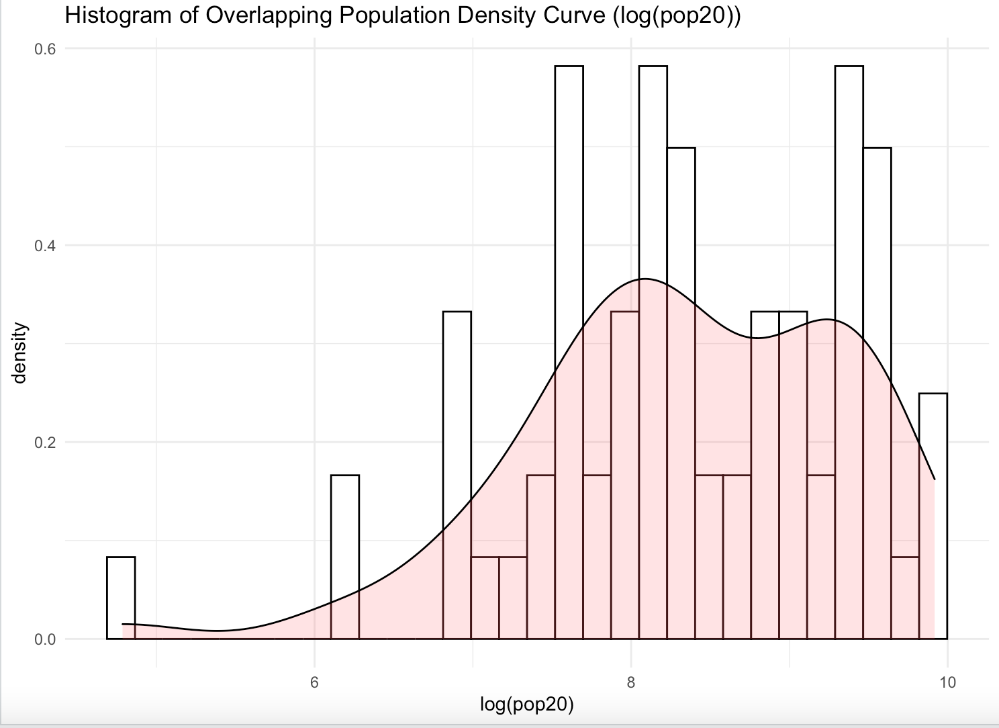
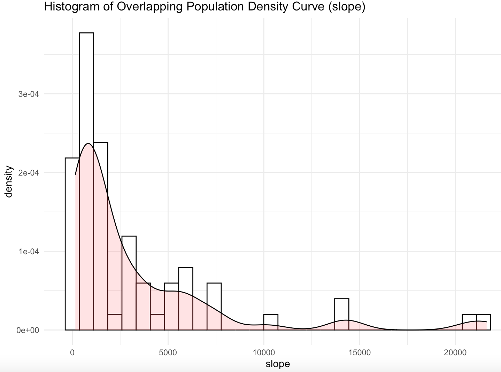
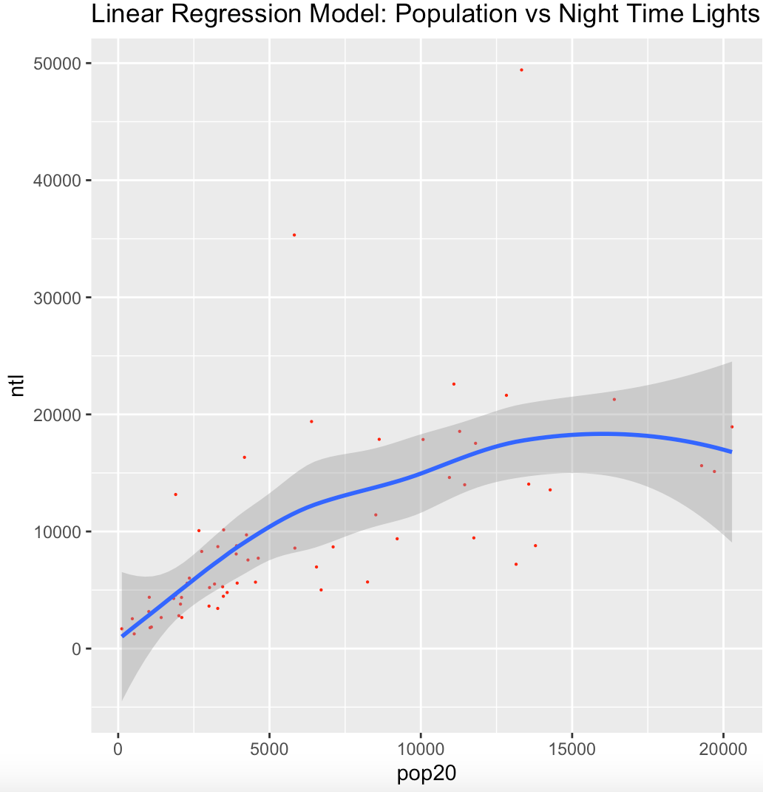
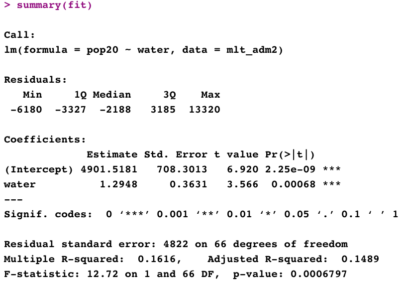
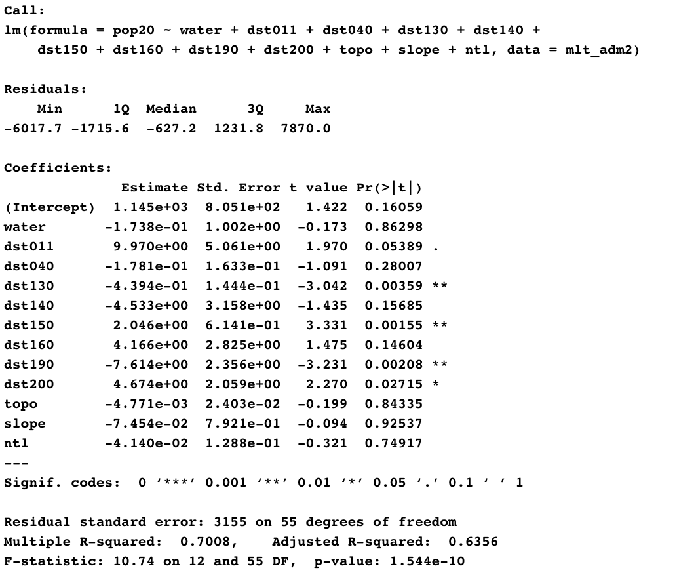

# Project 3 ~ Acquiring, Modifying, and Describing the Data: Malta

# Extracting Land Use and Land Cover Data for Description
#### The histogram represents the logarithm of the population count for each of the second level subdivisions of Malta

### The histogram represents the population density of Malta compared to the slope of the land. As expected, the population density is smallest when the slope is steepest.

# Explaining the Relationship between Variables with Estimated Regression Models 

## 
![](wtr.png

