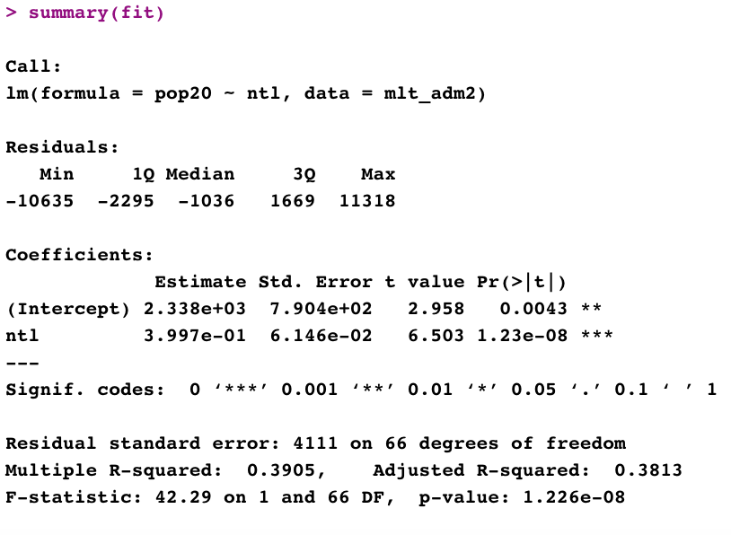

# Project 3 ~ Acquiring, Modifying, and Describing the Data: Malta

# Extracting Land Use and Land Cover Data for Description

# Explaining the Relationship between Population vs NTL and Water with Estimated Regression Models 

## 

