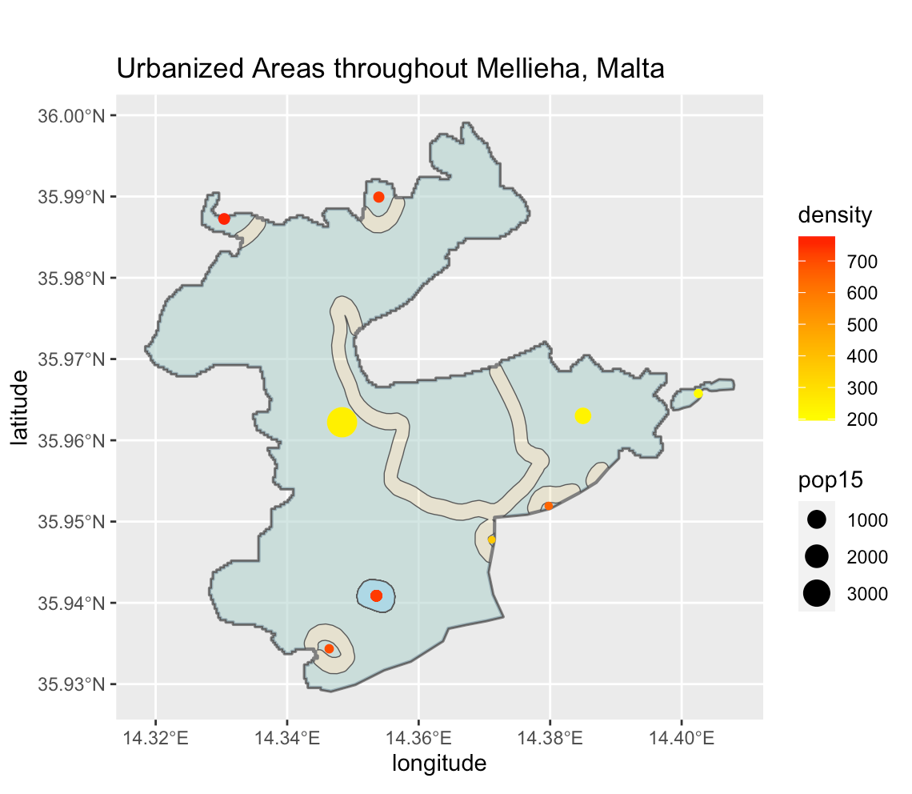
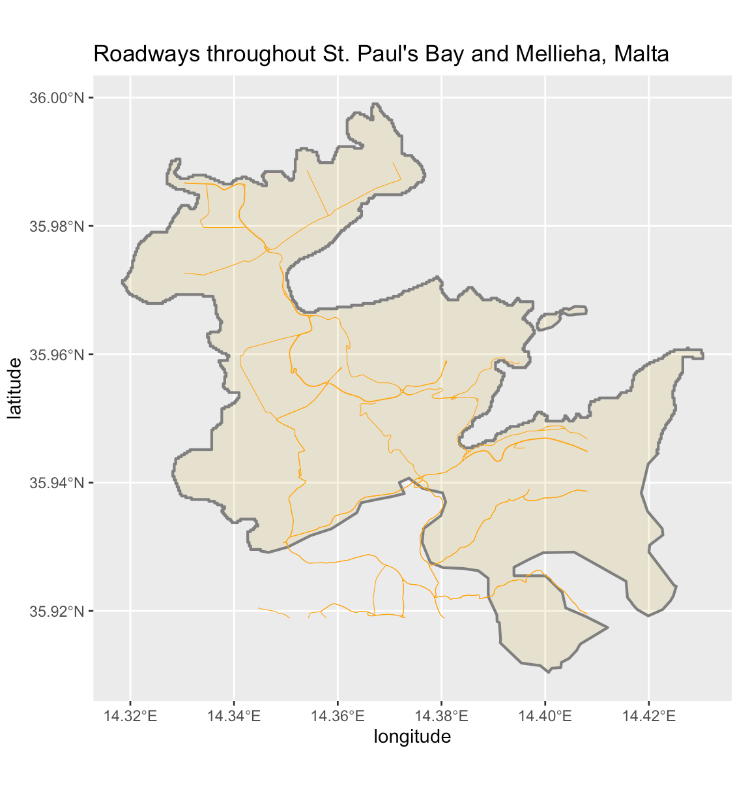

## Accessibility 1: De facto description of human settlements and urban areas

   .  

.  

.  

## Accessibility 2: Adding transportation facilities & health care services

.  

.  

#### The total population of Malta's adm2 subdivisons, St. Paul's Bay and Mellieha, is 26,278 persons, and there are 6 distinctly defined human settlements within the two divisions. As indicated by the plot, the north-west and south-central regions have the highest population densities of the combined area. Notably, the population density is relatively low in areas where there is greater access to health care (black crosses indicate health care facilities: dentists, pharmacies, hospitals, and clinics). Consisting of primary, secondary, and tertiary roads, the network of roadways throughout Malta are, for the most part, evenly distributed, connecting urban settlements to areas with health care facilities. 

.  
