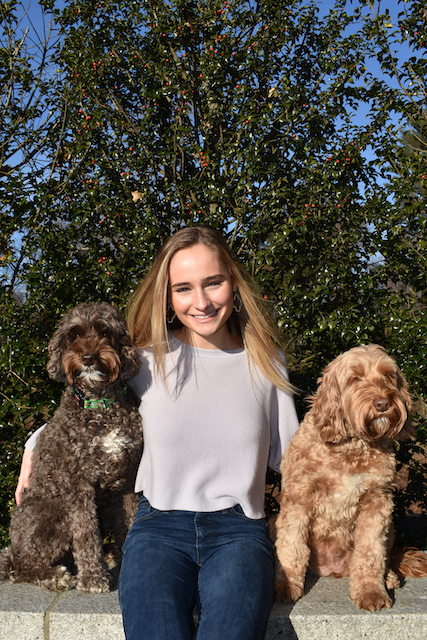

# Welcome to my wicked problems repository!
My name is Hannah George. I am a first year student here at the College of William and Mary, and I am originally from Boston, Massachusetts. Wicked Problems is the first data science course I have taken, and my experience with coding is very limited, although I did a 3-week project working with javascript my freshmen year of high school. My major is currently undecided, but my primary academic interests are in Biology, Anthropology, and Business Analytics. A fun fact about me is that I worked the overnight shift at a 24-hour local bakery on Cape Cod for the past four summers, and during the school year I work as a doordasher and as an instacart driver. Some of my hobbies include pottery, candle making, snowboarding, and cooking. I am looking forward to learning how to use R Studio and GitHub in this course. 

# Here is a pic of me with my two dogs

## PROJECTS
[Challenge Problem](https://hannahgeorge-wickedproblems.github.io/data100repository/hgchallengeproblem.html)

[Project 1 Deliverable](https://hannahgeorge-wickedproblems.github.io/data100repository/Project1.html), [Stretch Goal 2](https://hannahgeorge-wickedproblems.github.io/data100repository/StretchGoal2.html)

[Project 2 Deliverable](https://hannahgeorge-wickedproblems.github.io/data100repository/Project2.html), [Stretch Goal 1](https://hannahgeorge-wickedproblems.github.io/data100repository/StretchGoal1.html)

[Project 3 Deliverable] 

## INFORMAL RESPONSES 
[Informal Response 1](https://hannahgeorge-wickedproblems.github.io/data100repository/InformalResponse1.html)

[Informal Response 2](https://hannahgeorge-wickedproblems.github.io/data100repository/InformalResponse2.html)

